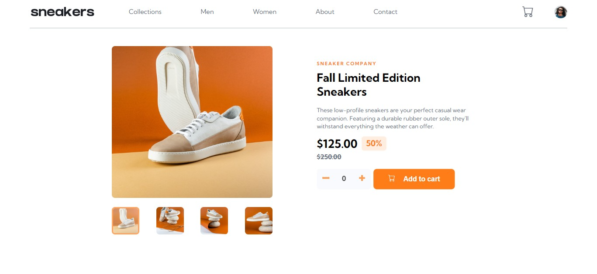

# Frontend Mentor - E-commerce product page solution

This is a solution to the [E-commerce product page challenge on Frontend Mentor](https://www.frontendmentor.io/challenges/ecommerce-product-page-UPsZ9MJp6). Frontend Mentor challenges help you improve your coding skills by building realistic projects.

## Table of contents

-  [Overview](#overview)
   -  [The challenge](#the-challenge)
   -  [Screenshot](#screenshot)
   -  [Links](#links)
-  [My process](#my-process)
   -  [Built with](#built-with)
   -  [What I learned](#what-i-learned)
   -  [Continued development](#continued-development)
   -  [Useful resources](#useful-resources)
-  [Author](#author)

## Overview

### The challenge

Users should be able to:

-  View the optimal layout for the site depending on their device's screen size
-  See hover states for all interactive elements on the page
-  Open a lightbox gallery by clicking on the large product image
-  Switch the large product image by clicking on the small thumbnail images
-  Add items to the cart
-  View the cart and remove items from it

### Screenshot

### Links

-  Solution URL: [My solution](https://github.com/Multimarix/ecommerce-product-page-react)

-  Live Site URL: [Ecommerce Product Page](https://ecomm-product-page-react.netlify.app/)

## My process

### Built with

-  Semantic HTML5 markup
-  CSS custom properties
-  Flexbox
-  CSS Grid
-  Mobile-first workflow
-  [React](https://reactjs.org/) - JS library
-  [Styled Components](https://styled-components.com/) - For styles

### What I learned

I learned a little more on CSS GRID through this project. I also saw myself making some mistakes when dealing with the useState hooks at some point but after some research, i was able to resolve the problem. I gained a little experience there too.

### Continued development

I plan to continue building more react projects and improve on my styling prowess and css grids as well.

### Useful resources

-  [state mistakes with react](https://www.example.com) - I was able to correct the issue i was having with the useState hooks after watching this video

## Author

-  Frontend Mentor - [@Multimarix](https://www.frontendmentor.io/profile/Multimarix)
-  Twitter - [@Dee03189131](https://twitter.com/Dee03189131)
